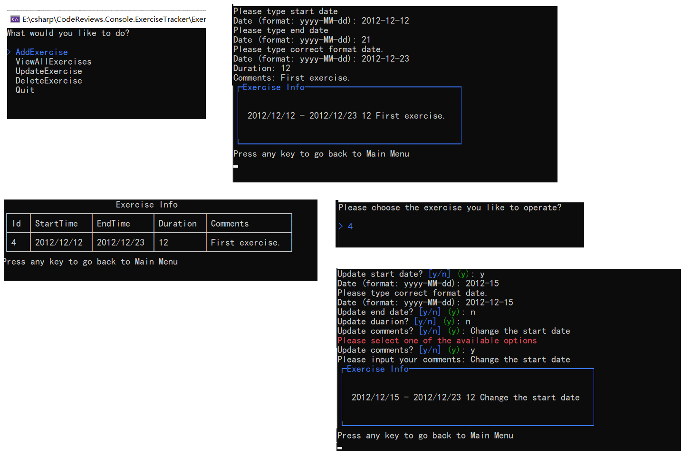

# Exercise Tracker Console Application

The Console application record the exercise data. It utilizes the `Repository Pattern` in its implementation.

## ScreenShots

Here is some screenshots in this application's run time.

## Reference

* [Tutorial: Use dependency injection in .NET](https://learn.microsoft.com/en-us/dotnet/core/extensions/dependency-injection-usage)

* ChatGPT
